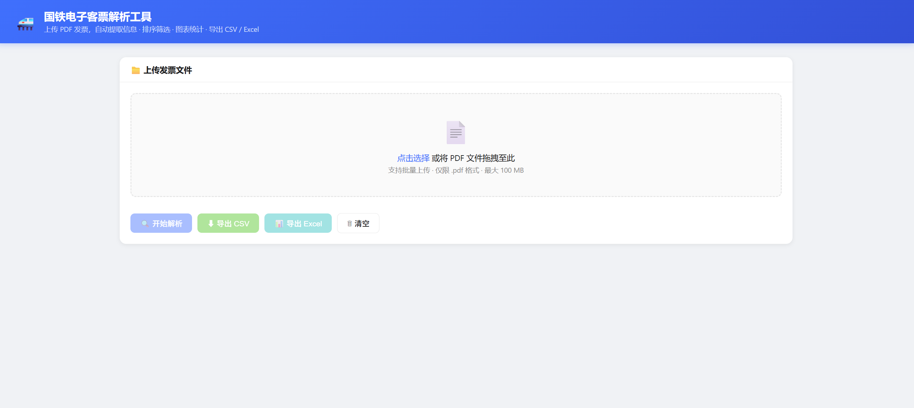

# 国铁电子客票解析工具

批量解析国铁 / 12306 电子客票 PDF，提取车次、站点、日期、票价、乘车人等字段，并支持 Web 查看、筛选、统计以及 CSV / Excel 导出。



## 功能

- 批量上传 PDF 并逐文件解析。
- 提取发票号码、开票日期、出发站、到达站、车次、乘车日期、票价等字段。
- Web 页面支持导入旧 CSV / Excel 表格、搜索、筛选、排序、图表统计和报销状态标记。
- 支持 CSV 与多 Sheet Excel 导出。
- CLI 支持批量扫描目录并输出 `tickets.csv`。

## 项目结构

```text
Extract_tickets/
  src/extract_tickets/
    constants.py       # 字段、状态、常量
    parser.py          # PDF 文本提取与票据字段解析
    export.py          # CSV / Excel 导出
    web.py             # Flask app factory 与路由
    cli.py             # 命令行入口
    config.py          # 应用配置
  templates/
    index.html         # Web 页面
  tests/               # pytest 测试
  app.py               # 兼容旧 Web 启动入口
  extract_tickets.py   # 兼容旧 CLI 启动入口
  parser.py            # 兼容旧 import parser 入口
```

## 安装

```bash
pip install -r requirements.txt
```

推荐开发安装：

```bash
pip install -e ".[dev]"
```

## Web 使用

```bash
python app.py
```

打开：

```text
http://127.0.0.1:8088
```

页面中的“导入旧表格”支持读取本项目导出的 `tickets.csv`、`tickets.xlsx` 或同字段格式的表格。导入后可继续上传新的 PDF，新增记录会追加到当前结果中，再统一筛选和导出。

可通过环境变量覆盖默认监听地址、端口和上传大小限制：

```powershell
$env:FLASK_HOST = "127.0.0.1"
$env:FLASK_PORT = "9000"
$env:MAX_CONTENT_LENGTH = "209715200"
python app.py
```

对应含义：

| 环境变量 | 默认值 | 说明 |
| --- | --- | --- |
| `FLASK_HOST` | `127.0.0.1` | 服务监听地址 |
| `FLASK_PORT` | `8088` | 服务监听端口 |
| `MAX_CONTENT_LENGTH` | `104857600` | 最大请求体大小，单位字节 |

## CLI 使用

解析当前目录内的 PDF：

```bash
python extract_tickets.py
```

解析指定目录：

```bash
python extract_tickets.py ./pdfs -o ./tickets.csv
```

## 字段

| 字段 | 说明 |
| --- | --- |
| 文件名 | 原始 PDF 文件名 |
| 发票号码 | 发票号码 |
| 开票日期 | 发票开具日期 |
| 出发站 | 起点站 |
| 到达站 | 终点站 |
| 车次 | 如 G6989、D1234 |
| 乘车日期 | 乘车日期 |
| 开车时间 | HH:MM |
| 车厢号 | 车厢编号 |
| 座位号 | 座位或铺位 |
| 席别 | 二等座、软卧等 |
| 票价(元) | 票价金额 |
| 乘车人 | 乘车人姓名 |
| 证件号(脱敏) | PDF 中已脱敏的证件号 |
| 电子客票号 | 电子客票号 |
| 备注 | 改签、学生票、异常状态等 |

## 开发

运行测试：

```bash
pytest
```

运行静态检查：

```bash
ruff check .
```

格式化：

```bash
ruff format .
```

## 隐私与安全

- 不要提交真实 PDF、CSV、Excel 或包含票据/身份信息的文件。
- `.gitignore` 已忽略 `*.pdf`、`tickets.csv`、`tickets.xlsx`。
- 测试样本应使用脱敏文本，不应使用真实票据原件。

## 已知限制

- 图片型或扫描件 PDF 不会自动 OCR，会被标记为“图片型PDF，需OCR，暂跳过”。
- 当前规则主要面向国铁 / 12306 电子客票版式。
- 前端报销状态只在当前页面内维护，导出前有效，不做服务端持久化。

更多解析规则见 [docs/parser-rules.md](docs/parser-rules.md)。
